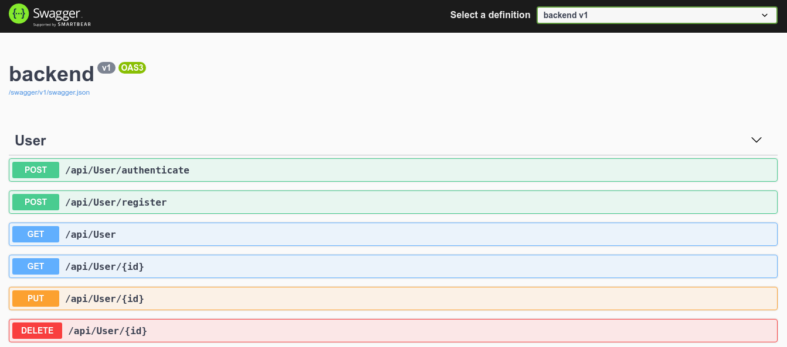
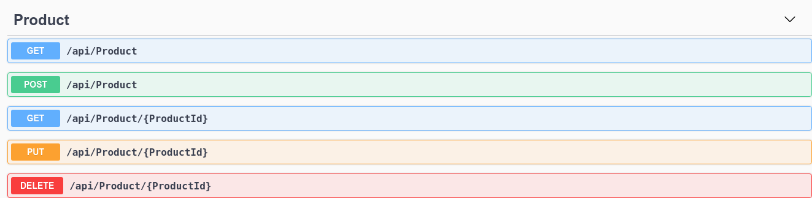

# API using Dotnet with JWT and IdentityModel

# User

# Product

# Description

- Project Dotnet with JWT, Auto Mapper, Swagger and Identity Model.

## Version

- Dotnet 5.0

## SGBD

- SQL Server (Tested with version 2019)

## To run

`dotnet run`

or

`dotnet watch run`

## To create migrations

- SQL Server EF Core Migrations:
  `dotnet ef migrations add InitialCreate`

## To create databases

`dotnet ef database update`

## Requirements

- SQL Server (2019 or higher)
- Dotnet (version 5.0)
- Dotnet EF (Entity Framework)
- Azure DataStudio (optional)
- Vscode or Visual Studio 2019
- Postman or Insomnia
- Swagger UI and JSON

## LICENSE

See [LICENSE](LICENSE.md)

## Docs

- [IdentityModel](https://identitymodel.readthedocs.io/en/latest/)
- [SQL Server](https://docs.microsoft.com/en-us/sql/sql-server/?view=sql-server-ver15)
- [Dotnet](https://docs.microsoft.com/en-us/dotnet/)
- [JWT](https://jwt.io/)
- [Auto Mapper](https://docs.automapper.org/en/stable/Getting-started.html)
- [Swagger](https://swagger.io/)
