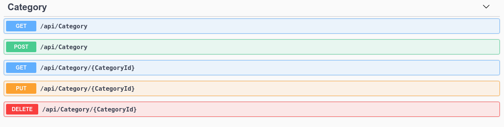

# API using Dotnet with JWT and IdentityModel

# User

# Product

# Category

# ER Diagram

# Description

- Project Dotnet API with JWT, Auto Mapper, Entity Framework, Swagger, Docker and Identity Model.

## Version

- Dotnet 5.0

## SGBD

- SQL Server (Tested with version 2019)

## To run

`dotnet run`

or

`dotnet watch run`

## To create migrations

- SQL Server EF Core Migrations: `dotnet ef migrations add InitialCreate`

## To create databases

`dotnet ef database update`

## Instructions to use Docker

[Docker images for ASP.NET Core](https://docs.microsoft.com/en-us/aspnet/core/host-and-deploy/docker/building-net-docker-images?view=aspnetcore-5.0)

## Requirements

- SQL Server (2019 or higher)
- Dotnet (version 5.0)
- Dotnet EF (Entity Framework)
- Azure DataStudio (optional)
- Vscode or Visual Studio 2019
- Postman or Insomnia
- Swagger UI and JSON
- Docker and Docker Compose

## LICENSE

See [LICENSE](LICENSE.md)

## Docs

- [IdentityModel](https://identitymodel.readthedocs.io/en/latest/)
- [SQL Server](https://docs.microsoft.com/en-us/sql/sql-server/?view=sql-server-ver15)
- [Dotnet](https://docs.microsoft.com/en-us/dotnet/)
- [JWT](https://jwt.io/)
- [Auto Mapper](https://docs.automapper.org/en/stable/Getting-started.html)
- [Swagger](https://swagger.io/)
- [Compose and ASP.NET Core with SQL Server](https://docs.docker.com/samples/aspnet-mssql-compose)
- [Dockerize an ASP.NET Core application](https://docs.docker.com/samples/dotnetcore/)